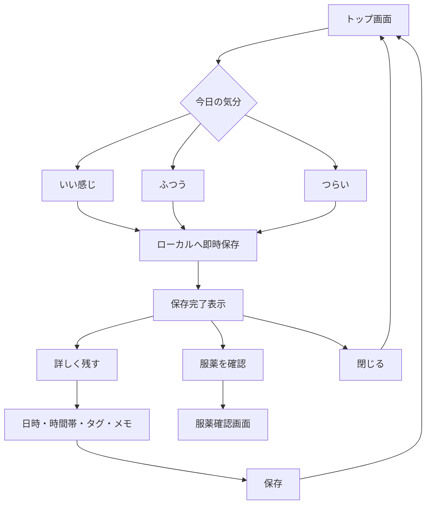
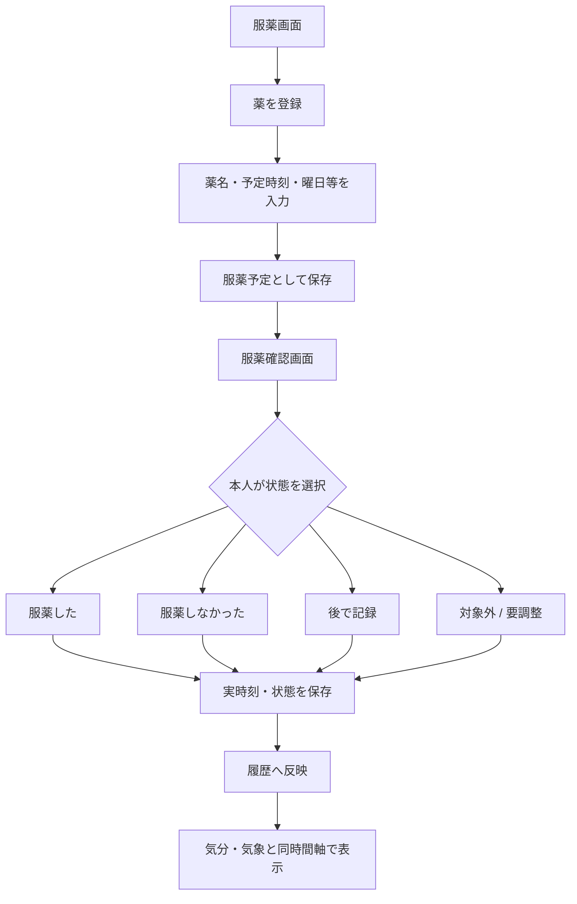
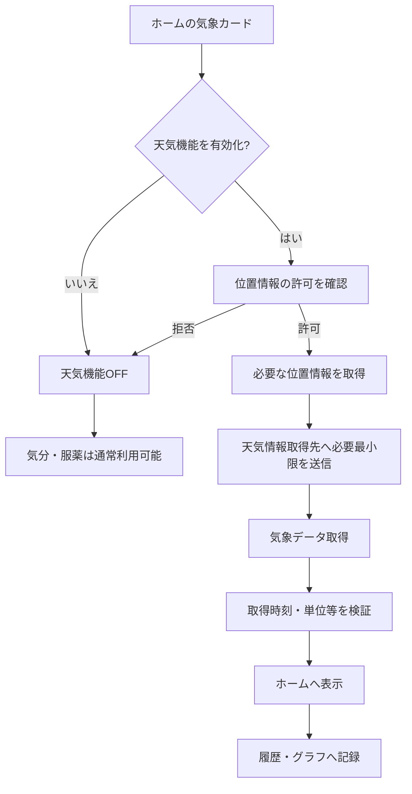
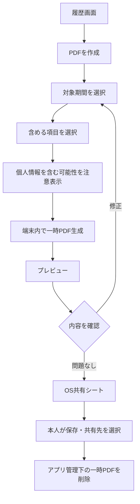
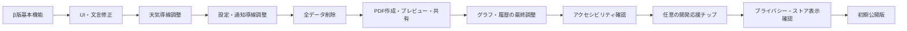
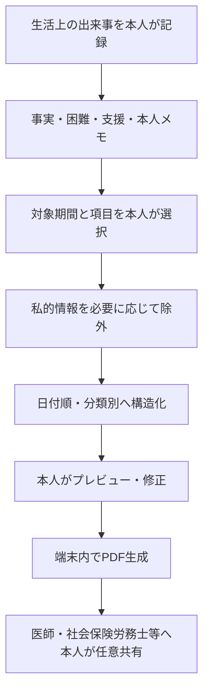
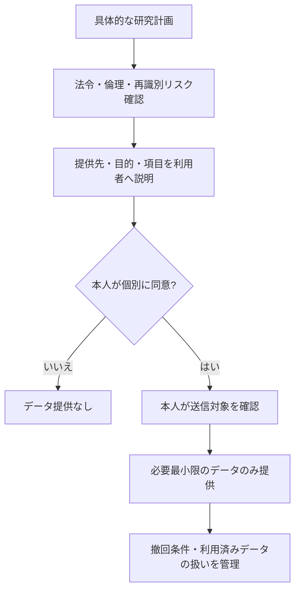
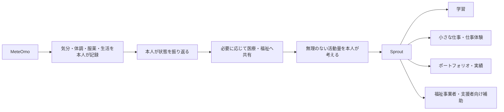
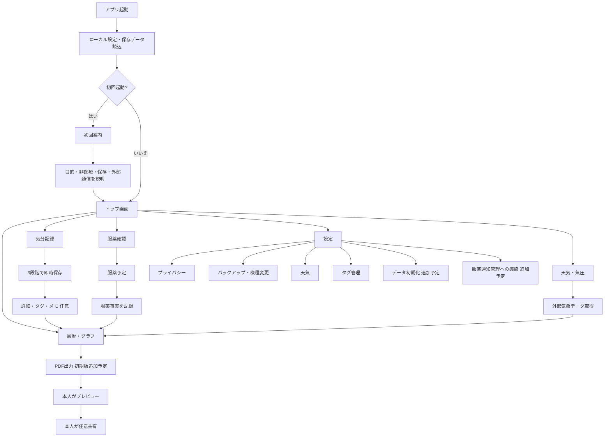
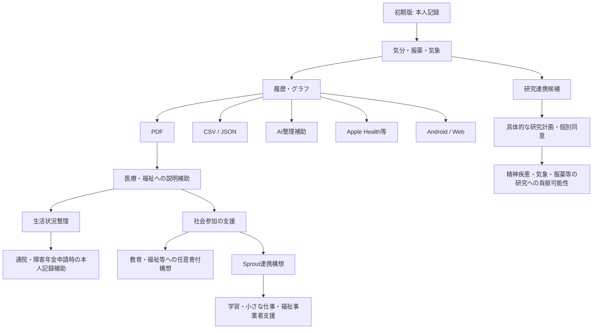

# MeteOmo 設計変更点・現行／今後実装 設計図・フローチャート

> 初期設計 `MeteOmo_Blueprints_and_Flowcharts.pdf`（2025-06-19）から、2026年8月時点の設計仕様・β版確認結果・将来構想を整理した公開用資料です。  
> 本資料では、共同開発上の個人名、連絡先、契約内部情報、非公開の個人的なやり取りは記載しません。

- 初期設計日：2025-06-19
- 本整理日：2026-08-26
- 初期公開対象：iPhone / iOS
- 現行実装方式：React Native
- 現在の段階：β版テスト・初期公開版の機能追加／調整中

---

## 1. この資料で使うステータス

| ステータス | 意味 |
|---|---|
| **β実装済み** | β版で動作・画面を確認できているもの |
| **初期版必須** | 初期公開版へ入れる設計になっているもの |
| **初期版追加予定** | 初期版向けだが、β版では未実装または調整中のもの |
| **要調整／要決定** | 仕様・表示・技術方式等が未確定のもの |
| **将来候補** | 初期版には入れず、公開後に別途検討するもの |
| **初期版除外** | 初期版には意図的に入れないもの |

---

# 2. 初期設計からの大きな変更点

## 2.1 プロジェクトの中心を「AI支援」から「本人記録」へ変更

### 初期設計

初期のMeteOmoでは、以下を一体化したメンタルヘルス支援プラットフォームを想定していました。

- 天気・気圧の取得
- 気分記録
- 服薬記録
- GPTによる声かけ・傾向分析
- PHQ-9等の定期チェック
- 将来的な研究機関へのデータ提供
- うつ病等の治療薬研究への貢献
- 医師向けPDF
- 国内外の教育・支援先への寄付

### 現在

初期公開版では機能を絞り、中心を以下へ変更しています。

> **主役はAIではなく、利用者本人の記録と可視化。**

現在の基本構成は、

1. 気分を低負担で記録する
2. 服薬した事実を記録する
3. 天気・気圧等の外部データを同じ時間軸へ並べる
4. 履歴・グラフで振り返る
5. 必要な場合はPDF化して本人が共有する

というセルフモニタリング中心の設計です。

AI、研究提供、健康尺度、クラウド同期等は初期版から切り離し、将来候補へ移動しました。

---

# 3. 機能別の変更点

## 3.1 開発基盤・対象OS

| 項目 | 初期設計 | 現在 |
|---|---|---|
| フレームワーク | Flutter / Dart | **React Native** |
| 初期対象 | iOS / Androidを想定 | **iPhone / iOSのみ** |
| Android | 同時展開を視野 | **将来候補** |
| Web | 将来検討 | **将来候補** |

初期設計にあったFlutter固有の `charts_flutter`、`flutter_localizations`、Provider / Riverpod / BLoC等の記述は、現行実装の直接要件ではありません。

一方、機能単位で分離し、将来の差し替え・拡張を行いやすくする方針は維持します。

---

## 3.2 気分記録

### 初期設計

- 「良い・普通・悪い」の3段階
- 朝・昼・夜の1日3回を意識した記録
- アプリを開かなかった日も自動記録する案
- 顔アイコンを押すと音・発光
- 保存後に服薬画面へ自動遷移
- 間違えた場合の「今日の気分修正」ボタン
- GPTによる声かけとの連携

### 現在

- 表示は **「いい感じ・ふつう・つらい」** の3段階
- 1回のタップで即時保存
- 1日に何回でも記録可能
- 未記録日は**空白のまま**保持
- 未記録を「ふつう」等で自動補完しない
- 記録を強制する達成率・連続記録評価を行わない
- 保存後に別画面へ強制遷移しない
- 保存完了表示から、本人が次の操作を選ぶ
- 「詳しく残す」からメモ・タグ・日時等を追加
- 保存完了表示中に別の気分を押した場合は直前記録を変更
- 保存完了表示を閉じる／画面を離れた後は新規記録として追加

### 現行フロー

---

## 3.3 気分詳細・タグ・メモ

### 現在の設計

- 気分記録後に任意で詳細を追記
- 日時・時間帯を編集可能
- 自由記述メモ：初期版では500文字を基準
- プリセットタグ＋本人追加タグ
- タグは最大15個を基準
- 複数タグ選択
- タグの表示名と内部IDを分離し、名称変更後も過去記録を壊さない
- 詳細入力後も服薬画面へ自動遷移しない

初期設計の「記録すると自動的に次へ進ませる」思想から、**本人がその場で終了できる設計**へ変更しています。

---

## 3.4 服薬記録

### 初期設計

- 薬・サプリ・食事を広く管理
- 薬名DB検索
- 効能・副作用情報
- 服薬後の効果・副作用評価
- 「飲んだ」ボタン
- 「偉いね」「飲めて偉い」等の褒める表示
- GPTによる薬×気分×気圧の傾向分析
- 朝・昼・夜・就寝前の固定枠

### 現在

服薬に関しては、**医療判断ではなく事実記録**に寄せています。

- 薬名を本人が登録
- 予定時刻・時間帯を登録
- 曜日指定を含む予定管理をβ版で確認中
- 予定と実際の服薬記録を分離
- 服薬状態を記録
  - 服薬した
  - 服薬しなかった
  - 後で記録
  - 対象外（表示・必要性は調整中）
- 実際に服薬した時刻を保存
- 後から時刻修正可能
- 予定の停止と、過去記録の削除を分離
- 「服薬を記録しました」等の中立的な表示
- 「偉い」「悪い」等の道徳評価をしない
- 薬の開始・中止・増減をアプリが指示しない
- 薬効や副作用をアプリが医学的に断定しない

### 現行フロー

---

## 3.5 天気・気圧

### 初期設計

- OpenWeatherMap APIを前提
- GPSで地域特定
- 天気・気圧・気温・湿度
- 過去データと気分の重ね合わせ
- AIが気圧変化から体調への影響を予測する案

### 現在

β版では **Open-Meteo** を利用した天気・気圧取得を確認しています。

- 天気
- 気圧
- 気温等の気象情報
- おおまかな現在地を利用
- 継続的な位置追跡を目的としない
- 外部通信の目的を利用者へ説明
- 提供元・ライセンス情報は詳細画面等で明示
- 最終更新時刻を表示
- 気象取得に失敗しても気分・服薬記録は継続可能
- 気圧変化は「上昇／下降／ほぼ変化なし」等の観測表現に限定
- 「気圧が下がるので体調が悪くなる」等の因果表現は禁止

### 初期版で変更された点

位置情報を許可しない場合、初期設計では「手動地域選択」を候補にしていましたが、**初期版では手動地域選択を実装せず、天気機能を使用しない方向**で整理されています。

### フロー

---

## 3.6 気象・気分・服薬のグラフ

### 初期設計

「気圧と体調の連動」という名称で、気圧・気分・薬を重ね、GPTによる傾向サマリーも想定していました。

### 現在

- 7日／30日／任意期間を基本候補
- 気分・服薬・気象を同じ期間へ表示
- 未入力を「服薬していない」と扱わない
- 気象データ欠損時も本人記録は表示
- 欠損を補間した場合は見分けられる表示
- 単位・凡例・軸を明確化
- 記録が少ない場合は「比較できる記録がまだ少ない」等を表示
- 自動で「相関あり」「原因」「改善」「悪化」と結論しない

名称上も「連動している」と先に決めつけず、**履歴・比較・可視化**を中心に扱う方向です。

---

## 3.7 PDF出力

### 初期設計

- 医師へ見せるPDF
- 「薬一覧」「気分一覧」等を個別出力
- GPT生成の傾向サマリー
- 気分平均スコア
- 薬の効果・副作用等を含む案
- 一時PDFを一定時間後に削除する案

### 現在

PDFは**初期版必須機能**ですが、2026年8月のβ版確認時点では未実装で、次の実装単位として追加予定です。

予定フロー：

### PDF内容候補

- 対象期間
- 作成日
- 任意表示名
- 記録日数
- 気分カテゴリごとの件数
- 服薬記録件数
- 気象データ取得日数
- 日時
- 気分
- タグ
- メモ
- 服薬状態
- 気象情報
- 気分・服薬・気圧等のグラフ
- 同内容のテキスト一覧
- 非医療・非診断の注意書き

### セキュリティ上の変更

- ファイル名へ個人名を初期値として入れない
- 日付＋ランダム識別子等を利用
- PDFメタデータへ個人名・薬名・自由記述を自動登録しない
- 外部サーバーで生成せず、端末内で生成
- 共有先へコピーされたファイルはアプリから消せないことを説明

---

## 3.8 バックアップ・機種変更

設計仕様書の初期案では、本人記録DBをOSバックアップ対象外とする方向も検討されていました。

しかしβ版では、iPhoneの標準的な機種変更・バックアップ復元を利用して記録を引き継げる動作が確認されており、**現在は機種変更時に復旧できる実装を採用する方向**です。

このため、正式な仕様書では以下を再整理する必要があります。

- iPhoneクイックスタート時の扱い
- iCloudバックアップ復元時の扱い
- 暗号化されたMac / PCバックアップ時の扱い
- 暗号鍵と記録DBの移行方式
- 復旧できない条件
- 利用者への説明

**ステータス：β実装済みの挙動を正式仕様へ反映予定。**

---

## 3.9 設定画面

### β版で確認できている主な項目

- MeteOmoが医療行為を行うアプリではないこと
- 外部通信に関する説明
- ローカル保存・暗号化に関する説明
- 気分タグ管理
- バックアップ・機種変更
- 天気連携
- アプリ情報

服薬通知は、設定画面で独立管理するよりも**服薬予定管理側へ統合**する構成になっています。

### 追加予定

- 設定画面から服薬予定・通知管理へのショートカット
- 「アプリデータを初期化」する全データ削除操作
  - 誤操作防止確認
  - 削除後は復元できない旨の表示
- 天気未設定時、ホームから天気設定位置へ直接移動する導線

### 初期版では見送るもの

- ダークモード
- 大規模な独自表示カスタマイズ
- 記録の自動削除

---

## 3.10 アクセシビリティ

初期設計の「視覚・聴覚支援対応」という抽象的な記述から、現在はより具体的な要件へ変更しています。

- iOSの文字サイズ設定への追従
- VoiceOver等の読み上げ
- ボタン名・選択状態・エラー内容の読み上げ
- グラフにテキスト代替を用意
- タップ領域は原則44×44pt以上
- 色だけで状態を示さない
- コントラスト確保
- 視差・アニメーション軽減設定を尊重
- 音だけで保存成功を伝えない

初期版ではOS標準のアクセシビリティ設定への追従を基本とし、アプリ独自設定は必要最小限にします。

---

# 4. 初期版から削除・延期された主な機能

以下は初期設計には存在しましたが、初期公開版からは外しています。

| 機能 | 現在の扱い |
|---|---|
| GPTによる健康相談 | 初期版除外／将来候補 |
| GPTによる天気・気圧からの体調予測 | 廃止方向。因果・健康予測を行わせない |
| GPTによる薬効評価 | 初期版除外。将来も医学的評価は禁止 |
| 「飲めて偉い」等の服薬評価 | 廃止 |
| PHQ-9の週1自動表示 | 初期版除外 |
| GAD-7 | 初期版除外 |
| 研究機関へのデータ提供 | 初期版除外 |
| 「治験」への包括同意 | 採用しない |
| クラウド同期 | 初期版除外 |
| アカウント登録 | 初期版除外 |
| Android / Web | 将来候補 |
| Apple Health / 医療記録連携 | 将来候補 |
| 未記録日の自動推定 | 廃止 |
| ストレス・メンタル状態の自動点数化 | 初期版除外。制度・重症度判定への使用は禁止 |
| ダークモード | 将来候補 |
| 自動削除 | 将来候補 |

---

# 5. 2026年8月時点の初期公開版ロードマップ

## 現在の整理

| 機能 | 状態 |
|---|---|
| 初回案内 | β実装済み・文言調整中 |
| 気分3段階記録 | β実装済み |
| 気分詳細・タグ・メモ | β実装済み・調整中 |
| 服薬登録 | β実装済み |
| 服薬予定・通知 | β実装済み・導線調整中 |
| 服薬履歴 | β実装済み |
| 天気・気圧 | β実装済み・表示調整中 |
| Open-Meteo帰属表示 | 実装済み・見せ方調整中 |
| 手動地域選択 | 初期版では実装しない方向 |
| 履歴・タグ絞り込み | β実装済み・説明調整中 |
| グラフ | 初期版必須・最終仕様確認 |
| PDF | **未実装／次の実装単位** |
| 全記録削除 | 追加予定 |
| バックアップ・機種変更 | β挙動あり／正式仕様へ反映予定 |
| アクセシビリティ | OS標準追従を中心に確認予定 |
| 支援情報 | 初期版候補／掲載範囲確認 |
| 開発応援チップ | 未実装／初期版予定 |
| 広告 | 初期版なし |
| サブスクリプション | 初期版なし |

---

# 6. 今後の実装候補（未定を含む）

## 6.1 障害年金・通院向け「生活状況整理」

初期版のPDFを発展させ、日常生活上の状態を本人が長期的に整理する構想です。

### 記録候補

- 対象日
- 入力日
- 体調の本人評価
- 自由メモ
- 食事
- 衛生
- 家事
- 金銭管理
- 外出
- 対人関係
- 手続
- 集中
- 仕事・学業
- 支援の有無・内容・頻度
- 通院日
- 通院時に伝えたい内容
- 医療・支援者から本人が受け取った説明のメモ

### 状態例

- できた
- 一部できた
- 支援があればできた
- できなかった
- 未評価

これらを単純な点数へ変換して、障害年金の等級や重症度を自動判定することはしません。

### フロー

### 不正確な記録を防ぐ方針

- 作成日時と対象日時を分離
- 後から入力した記録は「遡及入力」と分かるようにする
- 最終更新日時を保持
- AIが未記録部分を推測して埋めない
- 「申請に有利な文章」へ自動変換しない
- 診断書・申請書を自動完成させない
- PDFへ「本人の自己記録」であることを明示

**ステータス：将来候補。専門家確認等が必要。**

---

## 6.2 CSV / JSONエクスポート

PDFだけでなく、本人が自分のデータを持ち出せる形式を検討します。

- CSV
- JSON

目的はデータ可搬性・本人バックアップです。

実装時には、

- 形式バージョン
- 文字コード
- タイムゾーン
- 列定義
- 欠損値表現
- エクスポート項目選択
- インポート時の重複・改変・不正ファイル対策

を設計します。

クラウドへ自動アップロードせず、本人が保存先を選ぶことを基本にします。

**ステータス：将来候補。**

---

## 6.3 Android / Web版

iOS版公開後の候補です。

検討項目：

- OS／ブラウザごとの暗号化・鍵管理
- バックアップ
- 通知権限
- 電池制限
- PDF保存先
- Webキャッシュ
- 位置情報精度
- 決済方式
- アカウント同期を導入するか

**ステータス：将来候補・時期未定。**

---

## 6.4 AIによる記録整理補助

初期設計の「AIが心身状態を予測する」方式から、**AIは本人記録を整理する補助**へ位置づけを変更します。

導入する場合の原則：

- AIはMeteOmoの中心機能にしない
- 機能ごとに明示同意
- 送信直前に対象データを確認
- 送信項目を必要最小限にする
- 位置・薬名・自由記述等を無条件に一括送信しない
- 外部AIの保存・学習・保持・国外移転を導入時点の仕様で再確認
- APIキーをアプリへ直接埋め込まない
- AI生成文と本人の原文を区別
- 保存前に本人が確認・修正

### AIにさせないこと

- 診断
- 治療提案
- 薬効評価
- 服薬変更判断
- 天候と症状の因果断定
- 緊急性の断定
- 障害年金判定
- 危険語だけによる自動安全判定

**ステータス：将来候補。仕様・事業者・安全設計未定。**

---

## 6.5 クラウド同期・アカウント

導入する場合は、現在のローカル中心設計を大きく変更する機能として扱います。

検討が必要な事項：

- 認証
- パスワード回復
- 暗号化
- 端末紛失
- 退会・削除
- 同期競合
- 障害対応
- 保存地域
- 保持期間
- バックアップ残存
- エンドツーエンド暗号化の可否
- 同期対象を本人が選べる仕組み

初回から全記録を自動クラウド送信する方式は採用しない方向です。

**ステータス：将来候補。**

---

## 6.6 研究機関等へのデータ提供

初期設計では「将来、匿名で治験等へ提供」という包括的な構想がありましたが、現在はより厳密に分離します。

### 現在の原則

具体的な研究計画が決まっていない段階で、

> 「将来研究へ使う可能性があります」

という包括同意だけを取得し、後から送信する設計は採用しません。

研究連携を行う場合は、個別案件ごとに、

1. 提供先
2. 研究目的
3. 研究責任
4. データ項目
5. 利用期間
6. 再識別リスク
7. 同意撤回方法
8. 既に研究利用されたデータの扱い
9. 倫理審査
10. 法令・契約

を確認します。

### フロー

同意しなくてもMeteOmoの基本機能は利用可能にします。

**ステータス：長期構想。提供先・研究計画とも未定。**

---

## 6.7 健康データ・医療記録との連携

Apple Health等との連携は将来候補です。

検討項目：

- 読み取る項目
- 書き込む項目
- 権限
- 重複データ
- 削除
- 誤データ
- 医療記録の表示方法

MeteOmoの中心はあくまで「本人が日々記録すること」であり、外部健康基盤そのものを置き換えることは目指しません。

**ステータス：将来候補。**

---

## 6.8 PHQ-9 / GAD-7等

初期設計では、PHQ-9を週1回ポップアップ表示する案がありました。

現在は初期版から除外します。

将来導入する場合は、

- 利用条件
- 翻訳
- 権利
- 対象者
- 採点
- 結果表示
- 緊急時導線
- 専門家確認

を整理します。

週1回等の強制的な自動ポップアップは採用せず、結果を診断として表示しません。

**ステータス：将来候補。**

---

## 6.9 国内外の教育・福祉支援への寄付

初期設計にあった長期構想です。

本人が任意で、信頼性を確認した国内外の教育・福祉・支援先へ寄付する仕組みを検討します。

目的は単なる課金ではなく、

- 支援を受ける人も支援する側になれる
- 小さな社会参加の選択肢を作る
- 自尊心・自己効力感と社会貢献を結びつける

ことです。

ただし、

- 寄付を利用条件にしない
- 寄付しない利用者へ罪悪感を与えない
- 寄付先の信頼性を確認する
- 会計・法令・表示・送金手段を整理する

必要があります。

**ステータス：長期構想・実装時期未定。**

---

## 6.10 Sproutとの将来連携

MeteOmoで記録した状態をそのまま就労可否の判定に使うのではなく、本人自身が「今の状態で無理なくできること」を考えるための材料とし、将来的に福祉・学習・就労支援プラットフォーム **Sprout** へ接続する構想があります。

MeteOmoの健康・気分データをSproutへ自動送信することは前提にしません。

連携時には、

- 本人同意
- 共有項目
- 共有目的
- 閲覧権限
- 保存期間
- 削除
- セキュリティ

を別途設計します。

**ステータス：長期構想。**

---

# 7. 現在の全体設計図

---

# 8. 長期的なプロジェクト構造

---

# 9. 維持する設計原則

今後機能が増えても、以下はMeteOmoの基本原則として維持します。

1. **低負担**  
   体調が悪い時でも少ない操作で記録できる。

2. **非強制**  
   記録しない日、通知を切ること、機能を使わないことを失敗扱いしない。

3. **非断定**  
   天気、気圧、服薬、気分が同時に存在しても原因・診断・治療結果をアプリが決めない。

4. **本人管理**  
   記録・出力・共有・削除は可能な限り本人が操作する。

5. **透明性**  
   外部通信する場合は、目的・対象・送信先の種類を説明する。

6. **プライバシー優先**  
   取得できる情報を無条件に収集しない。

7. **アクセシビリティ**  
   文字、読み上げ、コントラスト、動き、タップ領域等へ配慮する。

8. **医療・行政判断の非代替**  
   診断、治療、服薬変更、緊急性、障害年金等級・受給可否を判定しない。

9. **AIを主役にしない**  
   将来AIを導入しても、本人記録を補助する範囲に限定する。

10. **将来機能を勝手に初期版へ混在させない**  
    研究、AI、同期、健康データ等は個別に安全性・法令・運用を確認してから追加する。

---

# 10. 現時点で未確定の主な事項

- PDFの対象期間・最大件数・ページ上限
- PDFの最終レイアウト
- 「対象外」等の服薬状態の最終仕様
- 気圧変化の計算期間・閾値
- 支援情報の初回掲載範囲
- 開発応援チップの価格・課金形式・表示場所
- 全データ削除の最終UX
- iOSバックアップ／機種変更仕様の正式文書化
- グラフの最終表示形式
- OS標準アクセシビリティで不足する部分のアプリ側対応
- 将来のAI利用方式
- 将来のクラウド同期方式
- Android / Web版の時期
- 研究連携の有無・提供先・研究計画
- 教育・福祉等への寄付機能の実施可否
- Sproutとの具体的なデータ連携方式

---

# 11. 文書上の位置づけ

この資料は、初期設計から現在までの変更を一般公開用に整理したものです。

- 初期設計に存在した案が、現在も実装予定とは限りません。
- 「将来候補」「長期構想」は実装を保証するものではありません。
- β版の画面・動作は公開版までに変更される可能性があります。
- 医療、診断、治療、服薬判断、障害年金等の専門判断をMeteOmoが代替することはありません。
- 研究や外部連携を行う場合は、初期版利用同意とは別に具体的な設計・同意・安全確認を行います。

---

## 関連資料

- `MeteOmo_Blueprints_and_Flowcharts.pdf` — 2025年6月19日の初期設計
- `MeteOmo_設計仕様書_Ver1.1_20260805.pdf` — 初版・将来実装を整理した設計仕様
- 2026年8月版 設計仕様書修正版ドラフト — 初期版の技術・UI方針を追加整理
- `README.md` — プロジェクト概要・思想・初期機能・将来構想
- `LICENSE.md` — 利用条件・権利関係

---

**Last Updated: 2026-08-26**
